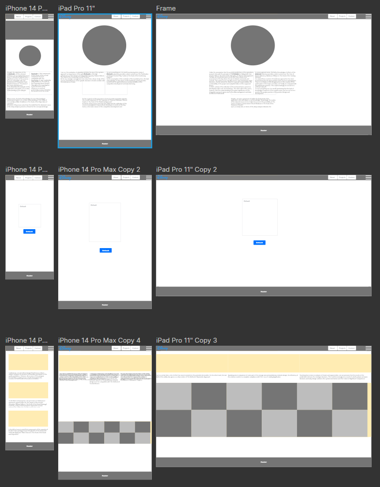
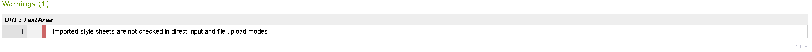

# Crossmark Developments Website

[view the live project](input github link)

## Description

Crossmark developments require a new and update website to host a gallery of projects to raise awareness of the business and showcase there work.
This website has been developed in order to facilitate marketing and raising awareness of the brand as well as the type of work it carries out.

### Usage

A static website for the purpose of raising awareness and advertising the business activities and projects

## User Experience UX

### User Stories

#### First Time User Goals

    1. As a First Time User, I want to be able to understand the site layout and movearound it intuitively and unimpeded

    2. As a First Time User, I want the website to be respopnsive across multipledevices but also fast load

    3. As a First Time User, I want to be able to gain useful and actionable informationon the company and its operations

    4. As a First Time User, I want to be able to make contact should I require more information on the business and my needs

#### Returning User Goals

    1. As a Returning User, I want to be able to navigate the website with familiarity

    2. As a Returning User, I want to be updated on the businesses activities in aninteractive way

    3. As a Returning User, I want to be able to continue on from previous visits and contact with the company

#### Frequent User Goals

    1. As a Frequent User, I want to be able to access the website quickly and easily

    2. As a Frequent User, I do not want to be inudated with popups and modals when navigating the website

    3. As a Frequent User, I want to recieve feedback from my interactions with the website and confirmation my contact has been recieved

### Design

#### Colour Scheme

    Colour Scheme has been based on the corporate colour scheme designed by the business and is reflective of the Crossmark Brand

#### Typography

    Open Sana font has been used throughout as this font has been designed for online and screen read devices to easy fatigue on the eyes and enable a cleaner more ledgible page

#### Imagery

    All images have been supplied by Crossmark, the Hero image has been placed within a circular border to create an element of space on the page, and a visual buffer between the nav bar and the content below.

### Wireframes



## Languages, Frameworks & Libraries

- HTML5 - Core
- CSS3 - Stylesheet
- Bootstrap5 - Interactive and Responsive Elements inc Navbar / Footer / Contact Form / Carousel
- Font Awesome - Icons
- JQuery - Interactive Elements inc Modal
- Git - Version Control
- GitHub - Code Storage and Deployment

## Features

- Responsive accross the primary Bootstrap5 breakpoints
- Some interactive elements

### Visuals

    Images courtesy of Crossmark Developments Limited and are owned by the business and used expressly for business use only.

    I have been granted permission to use images within the context of redesigning the website, the images however and business logo remain the sole property of    Crossmark with all rights reserved.

    Content has been taken from their current [website](crossmark.group)

## Testing

### Validator HTML / CSS

- 3 pages tested through [HTML Validator](https://validator.w3.org/#validate_by_input)

  - Minor errors have been rectified

- 1 page tested through [CSS Validator](https://jigsaw.w3.org/css-validator/#validate_by_input)
  - 1 error RE: external stylesheets are unable to be validated - This is due to the use of Bootstrap5 on the project development
    

### Lighthouse

    Performance testing of 3 pages via lighthouse
    [index.html](assets/testing/CM - index lighthousev1.0.pdf)
    [project.html](assets/testing/CM - project lighthousev1.0.pdf)
    [contact.html](assets/testing/CM - contact lighthousev1.0.pdf)

### User Testing

    Alpha Testing Feedback

### Bugs

    Hamburger menu not functioning - Fixed

### Fixes

    Required bootstrap5 js script

### Known Bugs

    Image distortion on project carousel images at different media widths

    Social links in footer - The company does not currently have any social media pages to link to.

### Further Testing

    - Website has been tested on Chrome, Firefox, and Internet Explorer
    - The website has been tested on a number of devices for style UX and responsiveness
    - Friends and family have reviewed the site for UX and bugs

## Deployment

### GitHub Pages

The project was deployed to GitHub Pages using the following steps...

1. Log in to GitHub and locate the [GitHub Repository](https://github.com/)
2. At the top of the Repository (not top of page), locate the "Settings" Button on the menu.
   - Alternatively Click [Here](https://raw.githubusercontent.com/) for a GIF demonstrating the process starting from Step 2.
3. Scroll down the Settings page until you locate the "GitHub Pages" Section.
4. Under "Source", click the dropdown called "None" and select "Master Branch".
5. The page will automatically refresh.
6. Scroll back down through the page to locate the now published site [link](https://github.com) in the "GitHub Pages" section.

### Forking the GitHub Repository

    By forking the GitHub Repository we make a copy of the original repository on our GitHub account to view and/or make changes without affecting the original     repository by using the following steps...

    1. Log in to GitHub and locate the [GitHub Repository](https://github.com/)
    2. At the top of the Repository (not top of page) just above the "Settings" Button on the menu, locate the "Fork" Button.
    3. You should now have a copy of the original repository in your GitHub account.

### Making a Local Clone

1. Log in to GitHub and locate the [GitHub Repository](https://github.com/)
2. Under the repository name, click "Clone or download".
3. To clone the repository using HTTPS, under "Clone with HTTPS", copy the link.
4. Open Git Bash
5. Change the current working directory to the location where you want the cloneddirectory to be made.
6. Type `git clone`, and then paste the URL you copied in Step 3.

```
$ git clone https://github.com/YOUR-USERNAME/YOUR-REPOSITORY
```

7. Press Enter. Your local clone will be created.

```
$ git clone https://github.com/YOUR-USERNAME/YOUR-REPOSITORY
> Cloning into `CI-Clone`...
> remote: Counting objects: 10, done.
> remote: Compressing objects: 100% (8/8), done.
> remove: Total 10 (delta 1), reused 10 (delta 1)
> Unpacking objects: 100% (10/10), done.
```

Click [Here](https://help.github.com/en/github/creating-cloning-and-archiving-repositories/cloning-a-repository#cloning-a-repository-to-github-desktop) to retrieve pictures for some of the buttons and more detailed explanations of the above process.

## Support

- Bootstrap 5 [Official](https://getbootstrap.com/)
- W3Schools [Bootstrap 5](https://www.w3schools.com/bootstrap5/index.php)

## Site map

- About Us
- Projects
- Contact Us

## Author

    jlewis-89

## Credit

- Code

  - Bootstrap Official Documentation
  - W3School
  - Code Institute

- Content
  - Bootstrap Official Documentation
  - W3School
  - Code Institute
- Media

  - Crossmark Developments Ltd
  - Crossmark.group
  - Font Awesome - Icons / Favicons

- Acknowledgements
  - Bootstrap Official Documentation
  - W3School
  - Code Institute - GitHub Development Template / Tutorship / README Layout, content and design
  - HTML Validator
  - CSS Validator

## License

    N/A

## Project Status

    In development
